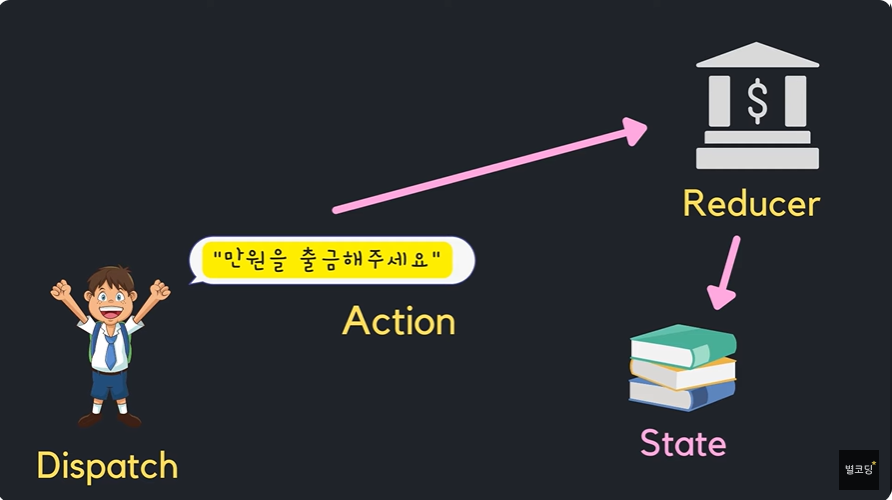
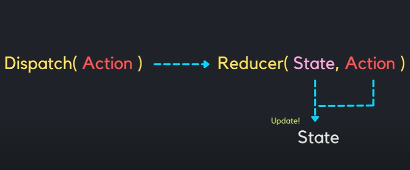

# 별코딩 useReducer
컴포넌트에 스테이트 생성관리 useState를 썻었음
useReducer도 일종의 관리
```json
{
  "teacher":"james",
  "students":["Kim","Ann","John"],
  "count":3,
  "location": [
    {"country":"Korea","name":"A"},
    {"country":"Australia","name":"B"},
  ]
}
```
같은 여러개의 하위값을 포함하는 복잡한 state를 다뤄야할때 유용
useState대신 useReducer를 사용하면 코드를 훨씬 깔끔하게 쓸수있으며 유지보수도 쉬워짐

### 그전에 3가지 개념을 알아야함
* Reducer
* Dispatch
* Action


예금,출금,송금 등의 Action을 첨부 할 수 있음


